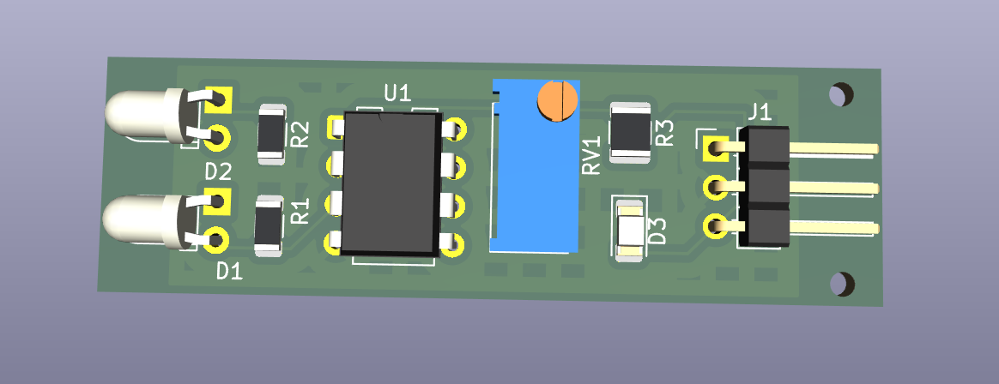
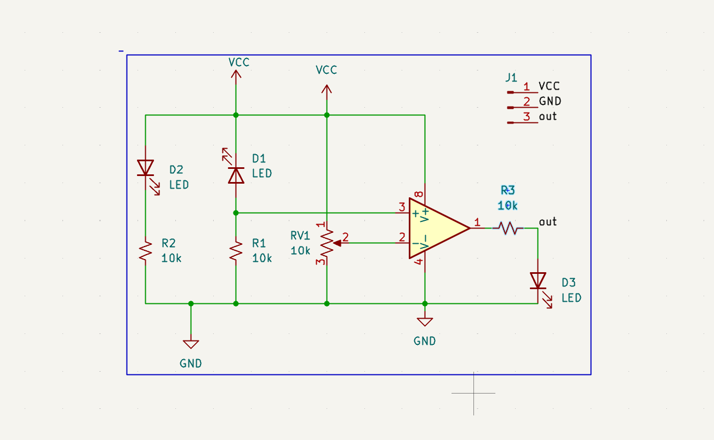
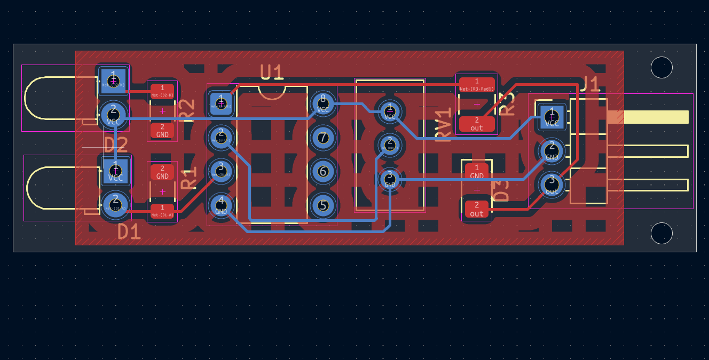
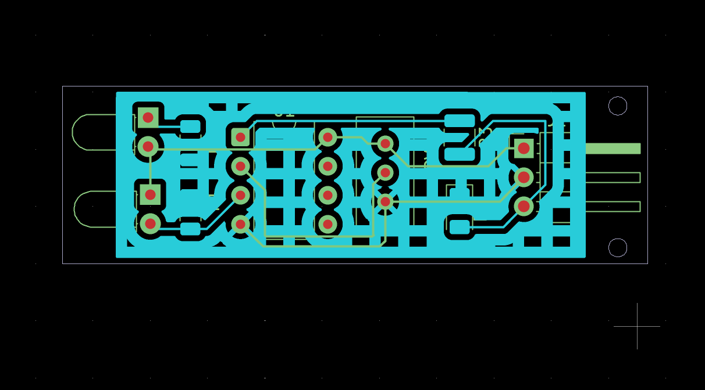
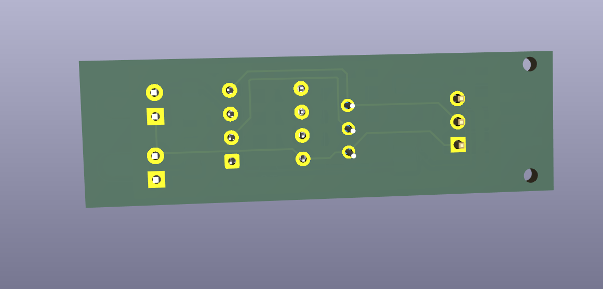
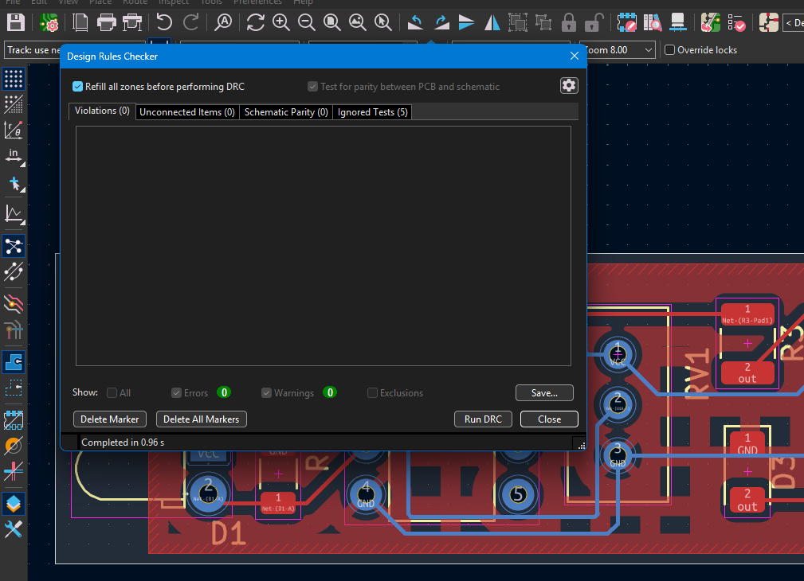

# IR Sensor PCB

A KiCad hardware project for a simple IR (infrared) obstacle/proximity sensor module, featuring an IR emitter/receiver pair, a comparator threshold circuit, sensitivity adjustment, and status indication.



## How It Works

- **D2** is the IR emitter LED, wired in series with current-limiting resistor **R2** directly across VCC/GND — it's always on, flooding the area ahead with IR light.
- **D1** is the IR receiver (photodiode/phototransistor), in series with **R1** forming a voltage divider. The midpoint feeds the **+** input of comparator **U1**.
- **RV1** (10k trimmer potentiometer) forms a second divider between VCC and GND, with its wiper feeding the **−** input of U1 — this sets the detection threshold/sensitivity.
- **U1** (single comparator, e.g. LM393/LM311-style DIP-8) compares the receiver signal against the threshold and switches its output accordingly.
- The output passes through **R3** to header **J1**, and drives status LED **D3** to indicate detection state.



## Bill of Materials

| Designator | Description       | Footprint                                   | Qty |
|------------|-------------------|----------------------------------------------|-----|
| D1         | IR receiver (photodiode/phototransistor) | LED_D3.0mm_Horizontal_O1.27mm_Z2.0mm_Clear | 1 |
| D2         | IR emitter LED    | LED_D3.0mm_Horizontal_O1.27mm_Z2.0mm_Clear   | 1   |
| D3         | Status LED        | LED_1206_3216Metric                          | 1   |
| J1         | 3-pin header (VCC, GND, out) | PinHeader_1x03_P2.54mm_Horizontal | 1   |
| R1, R2     | Resistor, 10k      | R_1206_3216Metric                            | 2   |
| R3         | Resistor, 10k      | R_1210_3225Metric                            | 1   |
| RV1        | Potentiometer, 10k (sensitivity/threshold trim) | Bourns 3296W (vertical trimmer) | 1 |
| U1         | Single comparator (e.g. LM393/LM311) | DIP-8 (0.3", 7.62mm) | 1 |

## Board Details

- **Layers:** 2-layer (F.Cu / B.Cu)
- **Board thickness:** 0.063 in (~1.6 mm, standard)
- **Front copper area:** 0.429 in²
- **Back copper area:** 0.077 in²
- **Min track width / clearance:** 0.0079 in (~0.2 mm)
- **Min drill diameter:** 0.0118 in (~0.3 mm)
- **Components:** 9 total (5 THT, 4 SMD), all on the front side
- **Pads:** 18 through-hole, 8 SMD
- **Vias:** 4 through-vias
- **DRC:** 0 errors, 0 warnings ✅

## Connector (J1)

| Pin | Function |
|-----|----------|
| 1   | VCC      |
| 2   | GND      |
| 3   | out (digital detection signal) |

## PCB Layout

| Top Copper (annotated) | Bottom Copper |
|---|---|
|  |  |

| 3D Top | 3D Bottom |
|---|---|
|  |  |

## Design Rules Check

Passed with 0 violations:



## Repository Contents

| File                     | Description                                  |
|--------------------------|-----------------------------------------------|
| `IR_SENSOR.kicad_pro`    | KiCad project file                            |
| `IR_SENSOR.kicad_sch`    | Schematic                                     |
| `IR_SENSOR.kicad_pcb`    | PCB layout                                    |
| `IR_SENSOR.kicad_prl`    | Local project settings (layer visibility etc.)|
| `IR_SENSOR.csv`          | Bill of materials (BOM)                       |
| `IR_SENSOR.rpt`          | KiCad DRC/electrical rules report             |
| `IR_SENSOR_report.txt`   | PCB statistics report (board area, pads, vias)|
| `docs/images/`           | Schematic, layout, 3D render, and DRC screenshots |

## Getting Started

1. Install [KiCad](https://www.kicad.org/) (version 7 or later recommended).
2. Clone this repository:
   ```bash
   git clone https://github.com/riteshh27/IR-SENSOR-PCB.git
   ```
3. Open `IR_SENSOR.kicad_pro` in KiCad to view/edit the schematic and PCB layout.

## Manufacturing

To generate Gerber files for fabrication:
1. Open the PCB layout in KiCad.
2. Go to **File → Fabrication Outputs → Gerbers**.
3. Export the drill file alongside the Gerbers.
4. Zip the output folder and upload to your preferred PCB fab (JLCPCB, PCBWay, etc.).

## License

See [LICENSE](LICENSE) for details.
